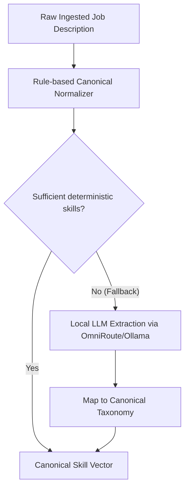

# AI & Matching Architecture

This document describes the matching engine, local embedding pipelines, and LLM fallback layers in **AI Job Agent India**.

---

## 1. Core Principles

- **Deterministic First**: Candidate eligibility and skill match calculations are computed deterministically. The AI does not act as a destructive filter that hides jobs from the candidate.
- **Explainability**: Every match produces an itemized breakdown of required skill overlap, missing skills, preferred skill bonus, and experience compatibility.
- **Zero Cloud Cost Embeddings**: Dense semantic representations use local ONNX inference with `BAAI/bge-small-en-v1.5` (384 dimensions).

---

## 2. Match Scoring Formulation

Match scores range between `0.0` and `1.0` (displayed as 0-100% in UI):

$$\text{Final Score} = w_{\text{req}} \cdot S_{\text{req}} + w_{\text{pref}} \cdot S_{\text{pref}} + w_{\text{trans}} \cdot S_{\text{trans}} + w_{\text{exp}} \cdot S_{\text{exp}} + w_{\text{loc}} \cdot S_{\text{loc}} + w_{\text{p}} \cdot S_{\text{p}}$$

Default weight configuration in `.env`:
- $w_{\text{req}}$ (Required Skills): `0.65`
- $w_{\text{pref}}$ (Preferred Skills): `0.10`
- $w_{\text{trans}}$ (Transferable Skills): `0.10`
- $w_{\text{exp}}$ (Experience Fit): `0.05`
- $w_{\text{loc}}$ (Location Fit): `0.05`
- $w_{\text{p}}$ (Role / Preferences): `0.05`

---

## 3. Skill Extraction Pipeline

1. **Deterministic Canonicalizer**: Matches tokens against comprehensive tech dictionaries (Python, FastAPI, Docker, PyTorch, React, etc.).
2. **LLM Fallback**: If the job description is sufficiently long (> 200 chars) and yields fewer than 2 deterministic skills, the system queries the local LLM endpoint to extract structured skills as JSON, then maps them back to the canonical taxonomy.

---

## 4. Dense Vector Retrieval (pgvector)

- Embedding model: `BAAI/bge-small-en-v1.5` via fast local runtime.
- Dimensions: 384.
- Distance metric: Cosine distance (`<=>` operator in PostgreSQL pgvector).
- Used for semantic similarity search and candidate-profile affinity ranking alongside deterministic criteria.
