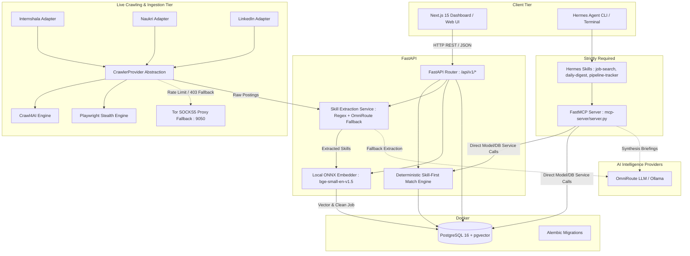

# AI Job Agent India — System Architecture & Specification (Phase 32)

## 1. System Overview

AI Job Agent India is an autonomous, precision job discovery and recommendation system tailored for the Indian entry-level engineering market (0–2 years experience). It implements strict 24-hour freshness, deterministic skill-first scoring, Crawl4AI-hardened web ingestion, local LLM/embedding intelligence, and native Hermes Agent FastMCP tool integration.

### Core Architectural Pillars (Strictly Required)

1. **Persistence & Vector Storage**: PostgreSQL 16 + pgvector, managed via Alembic migrations.
2. **Core Backend & Ingestion Engine**: FastAPI, Crawl4AI, Playwright stealth adapters, deterministic skill matcher, local ONNX embeddings (`BAAI/bge-small-en-v1.5`).
3. **Hermes Agent & FastMCP Tool Tier**: Local FastMCP server providing 10 specialized tools, Hermes autonomous agent skills (`job-search`, `daily-digest`, `pipeline-tracker`).
4. **Web Frontend Tier**: Next.js 15.1 App Router, React 19, Tailwind CSS, Lucide icons.

---

## 2. Target System Architecture Diagram

---

## 3. Subsystem Responsibilities & Boundaries

### 3.1 Persistence & Data Tier (`backend/app/models`, `backend/alembic`)
- **Tables**: `jobs`, `companies`, `candidate_profile`, `preferences`, `saved_jobs`, `search_history`, `audit_logs`.
- **Vectors**: 384-dimensional dense vectors stored via `pgvector` (`Vector(384)`) for hybrid semantic retrieval and tie-breaking.
- **Freshness Constraint**: Every queried listing strictly obeys `posted_at >= NOW() - INTERVAL '24 HOURS'` anchored to `Asia/Kolkata` (IST).
- **Rule**: API endpoints and background tasks MUST interact with persistence through SQLAlchemy async sessions.

### 3.2 Ingestion & Crawling Tier (`backend/app/crawling`, `backend/app/sources`)
- **Provider Abstraction**: `CrawlerProvider` base class decoupling adapters from crawler implementations.
- **Adapters**:
  - `InternshalaAdapter`: Ephemeral Chromium contexts, dynamic viewport randomization, anti-bot perimeter detection.
  - `NaukriAdapter`: Native `__NEXT_DATA__` JSON extraction layer, early-career floor normalization.
  - `LinkedInAdapter`: Triple-stage (Public Guest API $\to$ Crawl4AI rendered $\to$ Headless Playwright stealth).
- **Network Resilience**: Automatic Tor SOCKS5 proxy fallback (`socks5://127.0.0.1:9050`) on HTTP 429 / 403 blocks.
- **Recall-First Principle**: Jobs are never dropped during ingestion due to subjective criteria; jobs are normalized, assigned confidence metadata, and persisted for candidate review.

### 3.3 Intelligence & Matching Engine (`backend/app/intelligence`)
- **Skill-First Model**:
  - Required Skills: **65%**
  - Preferred Skills: **10%**
  - Transferable Skills: **10%**
  - Experience Alignment (0–2y): **5%**
  - Location Alignment: **5%**
  - Preferences Alignment: **5%**
  - Semantic Embedding: **0%** (used only for secondary tie-breaking)
- **Extraction Pipeline**: Fast regex taxonomy first pass; fallback to local OmniRoute / Ollama on sparse descriptions.

### 3.4 Hermes Agent & MCP Tier (`mcp-server/`, `skills/`) [Strictly Required]
- **Protocol**: FastMCP protocol server exposed via stdio / IPC or local server.
- **Exposed Tools (10)**:
  1. `get_candidate_profile`: Fetches skills, target roles, experience parameters.
  2. `search_jobs`: Bounded $\le 24\text{h}$ job query with role and freshness filters.
  3. `get_job`: Full job detail with verified application URL.
  4. `match_job`: 6-dimension breakdown for specific job ID.
  5. `rank_jobs`: Batch ranking and sorting of candidate listings.
  6. `save_job`: Bookmark for manual review.
  7. `ignore_job`: Dismiss from active recommendations.
  8. `update_application_status`: Progress status (`DISCOVERED`, `APPLIED`, `INTERVIEWING`, `OFFER`, `REJECTED`).
  9. `get_saved_jobs`: View tracked applications and notes.
  10. `get_search_history`: Review execution and discovery history.
- **Autonomous Skills**:
  - `job-search`: 5-step automated discovery loop.
  - `daily-digest`: Morning summary of fresh high-scoring opportunities.
  - `pipeline-tracker`: Manual application stage tracking.
- **Boundary Constraint**: MCP tools invoke backend domain handlers cleanly without side-channel table modifications. Auto-apply is forbidden; application URLs are provided for manual candidate action.

### 3.5 Web Presentation Tier (`frontend/`)
- **Technology**: Next.js 15.1 App Router, React 19, Tailwind CSS.
- **Client Philosophy**: User-controlled filter pills (skills, experience, salary, remote); never silently filters out listings on server.
- **Pages**:
  - `/` (Dashboard / Overview)
  - `/jobs` (Fresh Discovery Feed & Status Tracking)
  - `/saved` (Application Tracking Pipeline)
  - `/profile` (Candidate Skills & Target Roles)
  - `/resume` (Active Resume Management)
  - `/settings` (Preferences & Live Source Ingestion Sync)
  - `/settings/audit-logs` (Sync and Health Audit History)

---

## 4. Configuration & Environment Standards

All system configurations read from root `.env` via `backend/app/config.py` (`pydantic-settings`).

| Variable Name | Default Value | Purpose |
|---|---|---|
| `DATABASE_URL` | `postgresql+asyncpg://...` | Async connection string for PostgreSQL |
| `FRESHNESS_HOURS` | `24` | Strict recency eligibility boundary |
| `DEFAULT_TIMEZONE` | `Asia/Kolkata` | Canonical timezone for Indian job market |
| `EXPERIENCE_MAX_YEARS` | `2` | Ceiling for fresher/entry-level positions |
| `WEIGHT_REQUIRED_SKILL_MATCH` | `0.65` | Dominant skill-first scoring weight |
| `LLM_PROVIDER` | `ollama` | Primary local LLM engine |
| `OLLAMA_BASE_URL` | `http://localhost:11434/v1` | Ollama API endpoint |
| `LLM_BASE_URL` | `http://localhost:20128/v1` | OmniRoute fallback endpoint |
| `CRAWL4AI_ENABLED` | `true` | Enable Crawl4AI provider |
| `TOR_PROXY_URL` | `socks5://127.0.0.1:9050` | Local Tor SOCKS5 proxy URL |
| `MCP_SERVER_PORT` | `8001` | Dedicated FastMCP port |

---

## 5. Coding & Contribution Conventions

1. **Python**: Python 3.11+, typed (`typing` / Pydantic v2), async-first (`asyncio`, `httpx`, `asyncpg`).
2. **Deterministic Matching**: Scoring logic must never be delegated to non-deterministic LLM prompts. Scoring calculations reside entirely in Python code.
3. **No Auto-Apply**: System must never submit job applications on behalf of the user. Only verified original application URLs are surfaced.
4. **Testing**: Run pytest with PostgreSQL container running (`docker compose up -d postgres`). Tests must cover MCP tools and backend endpoints.
