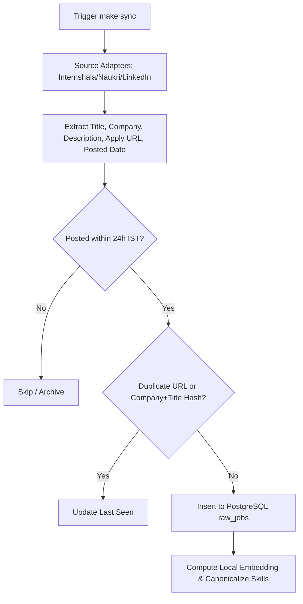

# Crawling & Ingestion Pipeline

This document details the multi-source scraping architecture, deduplication, and freshness guarantees in **AI Job Agent India**.

---

## 1. Recall-First Principle

The ingestion layer operates under strict recall preservation:
- We never drop a job because of low salary, high experience requirement, or missing skill tags.
- All scraped listings that meet the time boundary are preserved in the raw jobs store.
- Rejection filtering is left to client controls and user-selected filters on the dashboard.

---

## 2. Strict 24-Hour Freshness in IST

- **Timezone**: `Asia/Kolkata` (IST, UTC+5:30).
- **Rule**: Only jobs posted or refreshed within the last 24 hours from the run timestamp are accepted as current.
- Evaluated deterministically in Python datetime handling rather than prompt heuristics.

---

## 3. Supported Sources

| Source | Method | Key Features |
|---|---|---|
| **Internshala** | Playwright / Crawl4AI | Captures fresh internships and entry-level jobs in India. Extracts stipends, CTC, locations, and skills. |
| **Naukri** | Playwright / API / Browser | High-volume fresher software roles in India. |
| **LinkedIn** | Guest / Public job search | Targeted entry-level software & AI engineering listings. |

---

## 4. Ingestion Workflow

1. **Scraping**: Headless browser navigates source feeds.
2. **Freshness Filter**: Relative times ("Just now", "2 hours ago", "Today") converted to IST timestamps.
3. **Deduplication**: Checked by unique job ID, normalized application URL, and composite hashes (`company_name` + `job_title`).
4. **Enrichment**: Computes 384-d dense vector and canonical skill tags.
